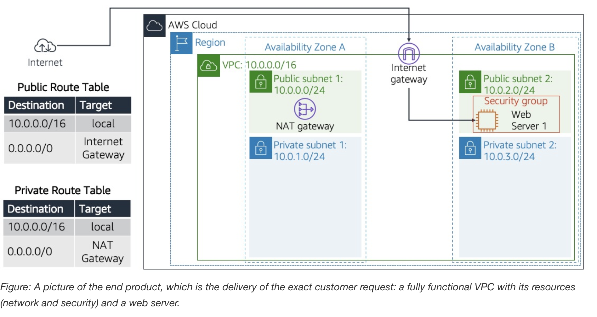
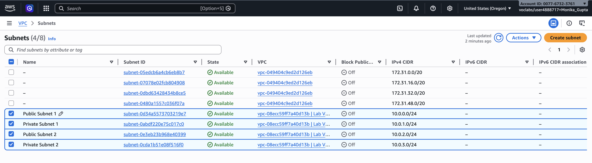
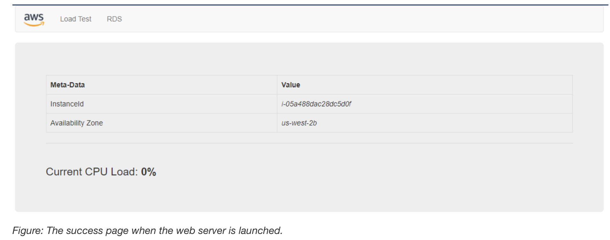

# Build a VPC and Launch a Web Server

An **AWS VPC** (Amazon Virtual Private Cloud) is a customizable, isolated network within AWS where you can run cloud resources like servers, databases, and applications securely. In simple terms, a VPC is your own private network in the AWS cloud.

### What you control in an AWS VPC

- **IP address range (CIDR block):** Define the size of your network  
- **Subnets:** Segment your network (e.g., public and private)  
- **Route tables:** Control how traffic flows  
- **Internet Gateway:** Enable internet access  
- **Security Groups & Network ACLs:** Manage access with firewall-like rules  

### Example setup

- Deploy a web server in a **public subnet** (internet-facing)  
- Place a database in a **private subnet** (no direct internet access)  
- Use security rules to control communication between them  

### Why AWS VPC is important

- **Isolation:** Separate your resources from others  
- **Security:** Fine-grained control over traffic  
- **Flexibility:** Support simple to complex architectures  
- **Hybrid connectivity:** Connect to on-premises via VPN or Direct Connect  

> AWS VPC is the foundation of networking in AWS, enabling secure and scalable cloud infrastructure.

---

## Lab Scenario

In this lab, a custom network infrastructure was built using **Amazon Virtual Private Cloud (VPC)** to simulate a real-world customer environment. The goal was to design and deploy a secure and scalable cloud architecture for hosting a web application.
The scenario represented a Fortune 100 customer requirement, where a fully configured VPC was needed to support both public-facing and private resources, along with a web server deployed on an EC2 instance.

The following diagram depicts the complete architecture that I deployed based on the customer's request:




**Objectives**

- Create a custom **VPC** with a defined CIDR range  
- Configure **public and private subnets** across Availability Zones  
- Set up **route tables** to manage network traffic flow  
- Attach an **internet gateway** and NAT gateway for internet connectivity  
- Create and configure a **security group** to allow HTTP access  
- Launch an **Amazon EC2 instance** inside the VPC  
- Deploy and configure a **web server** using user data scripts  
- Validate connectivity by accessing the web server via its public DNS  

This setup demonstrated how cloud networking, security, and compute services work together to deliver a functional and accessible web application environment in AWS.

---

### Accessing the AWS Management Console

1. At the top of the lab instructions, I chose **Start Lab**  
2. A *Start Lab* panel opened and displayed the lab status  

> 💡 **Tip:** If you need more time, choose **Start Lab** again to reset the timer  

3. Waited until the status shows **Lab status: ready**  
4. Closed the panel by selecting **X**  
5. Chose **AWS** at the top of the instructions  

This opened the **AWS Management Console** in a new browser tab and automatically signed me in.

> 💡 **Tip:** The new tab did not open as my browser was blocking pop-ups.  
> I allowed pop-ups using the browser notification or icon, then I tried again.

---

### Task 1: Create Your VPC

`I used the VPC Wizard to create a VPC along with an internet gateway, subnets, and a NAT gateway.`

An **internet gateway** allows communication between a VPC and the internet.  

Subnets are isolated network segments within a VPC:
- A **public subnet** has a route to the internet gateway  
- A **private subnet** does not have direct internet access  

A **NAT gateway**, enables instances in private subnets to access the internet securely.

### Steps

1. Opened the **AWS Management Console**
2. Searched for **VPC** in the top search bar and selected it
3. In the VPC dashboard, chose **Create VPC** and  configured:

   ```
   - Resources to create: VPC and more  
   - Name tag auto-generation: Uncheck *Auto-generate*  
   - IPv4 CIDR: 10.0.0.0/16  
   - IPv6 CIDR block: No IPv6 CIDR block  
   - Tenancy: Default  
   - Availability Zones (AZs): 1  
   - Public subnets: 1  
   - Private subnets: 1  

   - Public subnet (us-west-2a): `10.0.0.0/24`  
   - Private subnet (us-west-2a): `10.0.1.0/24`  
   - NAT gateways: In 1 AZ  
   - VPC endpoints: None

4. On the Preview pane, named the resources as follows:

   **VPC:** `Lab VPC ` 

   **Subnets (2):**
      - Public Subnet 1  
      - Private Subnet 1  

   **Route Tables (2):**
     - Public Route Table  
     - Private Route Table  

5. Chose `Create VPC`
   
      `Success message is displayed with VPC details. 
      Lab VPC details are displayed as per configuration.`

---

### Task 2: Create additional subnets

In this task, I created two additional subnets in a second Availability Zone. 

`This option is useful for creating resources in multiple Availability Zones to provide high availability.`

**Steps:**

1. In the left navigation pane, I chose Subnets.

2. To configure the second public subnet, I chose `Create subnet` and configured the following options:

    **VPC ID**: From the dropdown list, I chose `Lab VPC`
   
    **Subnet name**: `Public Subnet 2`
   
    **Availability Zone**: No preference
   
    **IPv4 CIDR block**: Enter 10.0.2.0/24
   
    Then, I chose `Create subnet`

`The subnet had all IP addresses starting with 10.0.2.x`

3. To configure the second private subnet, I chose `Create subnet` and configured the following options:

    **VPC ID**: From the dropdown list, choose `Lab VPC`
   
    **Subnet name**: `Private Subnet 2`
   
    **Availability Zone**: No preference
   
    **IPv4 CIDR block**: `10.0.3.0/24`

    Then, I Chose `Create subnet`

`The subnet had all IP addresses starting with 10.0.3.x`

The following screenshot shows the two subnets created in this task:



---

### Task 3: Associate the subnets and add routes

1. In the left navigation pane, I chose `Route Tables`

2. Chose `Public Route Table`

3. In the lower pane, I chose the `Subnet associations` tab.

4. Under `Subnets without explicit associations`, selected `Edit subnet associations`

5. Selected the check boxes for Public Subnet 2

6. Chose `Save associations`

 I now configured the route table that is used by the private subnets.

7. Chose `Private Route Table`

8. In the lower pane, chose the `Subnet associations` tab.

9. Under `Subnets without explicit associations`, chose `Edit subnet associations`

10. Selected the check boxes for Private Subnet 2

11. Chose `Save associations`

`My VPC now had public and private subnets configured in two Availability Zones`

---

### Task 4: Create a VPC Security Group

In this task, a VPC security group was created to act as a virtual firewall for the instance. When an instance is launched, one or more security groups can be associated with it. Rules can be added to control inbound and outbound traffic for the associated instances.

1. In the left navigation pane, **Security Groups** was selected.  
2. **Create security group** was chosen.  

#### Security Group Configuration

The security group was configured with the following settings:

- **Security group name:** Web Security Group  
- **Description:** Enable HTTP access  
- **VPC:** Lab VPC  

#### Inbound Rules

1. Under **Inbound rules**, **Add rule** was selected.  
2. The following rule was configured:

- **Type:** HTTP  
- **Source:** Anywhere IPv4  
- **Description:** Permit web requests  

3. **Create security group** was selected to finish the setup.  

This security group was then used in the next task when launching an Amazon EC2 instance.

---

### Task 5: Launch a Web Server Instance

In this task, an Amazon EC2 instance was launched into the new VPC and configured to act as a web server.

1. On the AWS Management Console, **EC2** was searched for and selected to open the EC2 Management Console.  
2. In the left navigation pane, **Instances** was selected.  
3. **Launch instances** was chosen and the following configurations were applied:

#### Name and Tags
- **Name:** Web Server 1  

#### Application and OS Images (Amazon Machine Image)
- **Quick Start:** Amazon Linux was selected  
- **AMI:** Amazon Linux 2 AMI (HVM) was selected from the dropdown  

#### Instance Type
- **t3.micro** was selected  

#### Key Pair (Login)
- **vockey** was selected  

#### Network Settings
- **Edit** was selected and the following settings were configured:
  - **VPC:** Lab VPC  
  - **Subnet:** Public Subnet 2  
  - **Auto-assign public IP:** Enabled  
  - **Firewall (security groups):** Select existing security group  
  - **Security group:** Web Security Group  

#### Advanced Details
- The **Advanced details** section was expanded for further configuration

#### User Data Configuration

Under **User data**, the following script was copied and pasted:

```bash
#!/bin/bash
#Install Apache Web Server and PHP
yum install -y httpd mysql php

#Download Lab files
wget https://aws-tc-largeobjects.s3.us-west-2.amazonaws.com/CUR-TF-100-RESTRT-1/267-lab-NF-build-vpc-web-server/s3/lab-app.zip
unzip lab-app.zip -d /var/www/html/

#Turn on web server
chkconfig httpd on
service httpd start

```

4. Launch and Connect to the Instance

- **Launch instance** was selected.  
- **View all instances** was chosen to display the launched instance.  
- The status of **Web Server 1** was monitored until it showed **2/2 checks passed** in the *Status check* column.  
- This process took a few minutes.  
- The page was refreshed using the **refresh** button at the top if needed.  

5. Connect to the Web Server

- The instance was selected using the checkbox.  
- The **Details** tab was opened.  
- The **Public IPv4 DNS** value was copied.  
- A new web browser tab was opened.  
- The copied DNS value was pasted into the address bar and entered.  

It was successful, the web server page was displayed in the browser as shown in the following screenshot:



---

## Conclusion

In this lab, a fully functional **Amazon VPC** environment was successfully designed and deployed to support a web application for a Fortune 100 customer.

A custom VPC was created with both public and private subnets, along with associated route tables, enabling proper network segmentation and traffic control. Additional subnets were added in a second Availability Zone to improve scalability and support high availability. Routing was configured to ensure correct subnet associations within the VPC.

A **security group** was then created to act as a virtual firewall, allowing HTTP traffic to reach the web server securely. Finally, an **Amazon EC2 instance** was launched into the public subnet, configured with user data to automatically install and start an Apache web server.

After deployment, the instance was verified to be running successfully and was accessed via its public DNS, confirming that the web server was reachable over the internet.

Overall, this lab demonstrated how to:
- Build a custom VPC network architecture
- Configure subnets, routing, and security controls
- Deploy and expose a web server using EC2 within a secure cloud environment

This exercise provided hands-on experience in designing scalable, secure, and production-like cloud infrastructure using AWS networking and compute services.

---


