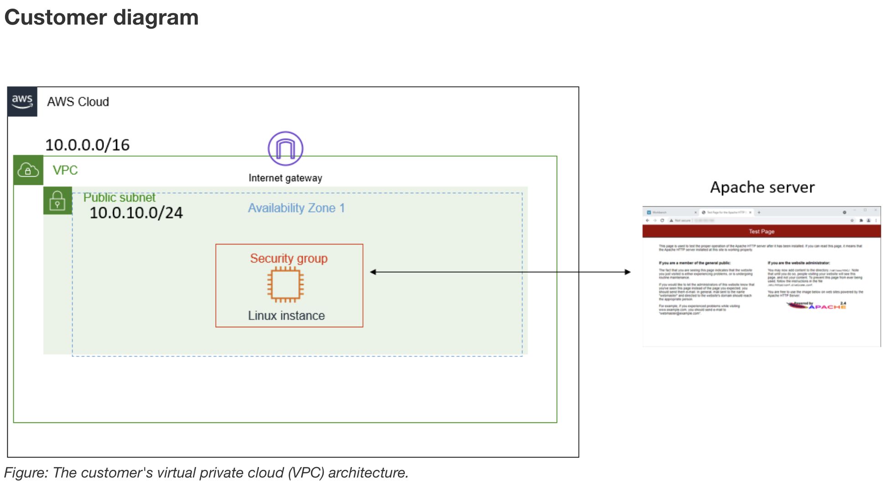

# Troubleshooting a Network Issue

### Lab Overview

In this lab, troubleshooting was performed on VPC configuration, and VPC Flow Logs were analyzed to identify and resolve networking issues in a cloud environment.

The environment consisted of two VPCs, EC2 instances, and supporting networking components. A CLI Host instance was used to run AWS CLI commands for troubleshooting and analysis.

The troubleshooting workflow followed a structured sequence:
1. Capturing network traffic using VPC Flow Logs  
2. Identifying connectivity issues affecting a web server instance  
3. Diagnosing and fixing routing, security group, and network ACL misconfigurations  
4. Validating access to the web server  
5. Analyzing flow logs to confirm rejected and accepted traffic patterns  

**Objectives**

By completing this lab, the following skills were developed:

- Creation and configuration of **VPC Flow Logs**
- Troubleshooting **VPC networking connectivity issues**
- Analysis of **network traffic logs** to identify access failures and patterns

---

### Scenario Summary

The lab simulated a real-world troubleshooting scenario where a web server hosted in a VPC was initially inaccessible due to misconfigured networking components. The objective was to restore connectivity while capturing and analyzing traffic data using VPC Flow Logs.

A CLI-based approach was used extensively to diagnose issues, including:
- Security group validation  
- Route table verification  
- Network ACL inspection  
- Log analysis using AWS CLI and Linux commands  

Email from the customer
>Hello, Cloud Support!
>
>When I create an Apache server through the command line, I cannot ping it. I also get an error when I enter the IP address in the browser.
>Can you please help figure out what is blocking my connection?
>
>Thanks!
>
>Ana
>
>Contractor

<br>



---

### Task 1: Use SSH to Connect to an Amazon Linux EC2 Instance

In this task, an SSH utility was used to connect to an Amazon Linux EC2 instance. The steps varied depending on the operating system used (Windows or macOS/Linux).

## Windows Users: Using SSH to Connect

These instructions were followed by Windows users:

- The **Details** drop-down menu was selected and **Show** was chosen. A Credentials window appeared.  
- The **Download PPK** button was selected and the `labsuser.ppk` file was saved (typically in the Downloads folder).  
- The **Public IP address** of the instance was noted.  
- The Details panel was closed by selecting **X**.  
- **PuTTY** was downloaded and installed if not already available.  
- `putty.exe` was opened.  
- A PuTTY session was configured following the instructions for connecting to a Linux instance using PuTTY.  

Windows users then proceeded to the next task.

## macOS and Linux Users: Using SSH to Connect

These instructions were followed by macOS/Linux users:

- The **Details** drop-down menu was selected and **Show** was chosen. A Credentials window appeared.  
- The **Download PEM** button was selected and the `labsuser.pem` file was saved.  
- The **Public IP address** of the instance was noted.  
- The Details panel was closed by selecting **X**.  

A terminal window was opened and the following steps were completed:

- The directory was changed to where the key file was downloaded:
  ```bash
  cd ~/Downloads

- Permissions for the key file were restricted:
  ```
  chmod 400 labsuser.pem

- The EC2 instance was accessed using SSH (replacing <public-ip> with the actual IP address):
  ```
  ssh -i labsuser.pem ec2-user@<public-ip>
  
- When prompted, yes was entered to confirm the connection.
- No password was required because authentication was performed using the key pair.

  
# Troubleshooting a Network Issue


## Task 1: Install httpd

I logged to the EC2 istance using `SSH` from a terminal. Then I start the `httpd` server.

```bash
chiara@macbook-air:~/labs$ chmod 700 labsuser.pem 
chiara@macbook-air:~/labs$ ssh -i labsuser.pem ec2-user@44.251.232.254
The authenticity of host '44.251.232.254 (44.251.232.254)' can't be established.
ED25519 key fingerprint is SHA256:wr4OdMHh0JcbuNLj1y978d5XjYO6cbDeE4a6LUJs5Ro.
This key is not known by any other names.
Are you sure you want to continue connecting (yes/no/[fingerprint])? yes
Warning: Permanently added '44.251.232.254' (ED25519) to the list of known hosts.
   ,     #_
   ~\_  ####_        Amazon Linux 2
  ~~  \_#####\
  ~~     \###|       AL2 End of Life is 2026-06-30.
  ~~       \#/ ___
   ~~       V~' '->
    ~~~         /    A newer version of Amazon Linux is available!
      ~~._.   _/
         _/ _/       Amazon Linux 2023, GA and supported until 2028-03-15.
       _/m/'           https://aws.amazon.com/linux/amazon-linux-2023/

[ec2-user@ip-10-0-10-234 ~]$ 44.251.232.254
-bash: 44.251.232.254: command not found
[ec2-user@ip-10-0-10-234 ~]$ sudo systemctl status httpd.service
● httpd.service - The Apache HTTP Server
   Loaded: loaded (/usr/lib/systemd/system/httpd.service; disabled; vendor preset: disabled)
   Active: inactive (dead)
     Docs: man:httpd.service(8)
[ec2-user@ip-10-0-10-234 ~]$ sudo systemctl start httpd.service
[ec2-user@ip-10-0-10-234 ~]$ sudo systemctl status httpd.service
● httpd.service - The Apache HTTP Server
   Loaded: loaded (/usr/lib/systemd/system/httpd.service; disabled; vendor preset: disabled)
   Active: active (running) since Mon 2026-04-13 13:54:42 UTC; 5s ago
     Docs: man:httpd.service(8)
 Main PID: 2525 (httpd)
   Status: "Processing requests..."
   CGroup: /system.slice/httpd.service
           ├─2525 /usr/sbin/httpd -DFOREGROUND
           ├─2526 /usr/sbin/httpd -DFOREGROUND
           ├─2527 /usr/sbin/httpd -DFOREGROUND
           ├─2528 /usr/sbin/httpd -DFOREGROUND
           ├─2529 /usr/sbin/httpd -DFOREGROUND
           └─2530 /usr/sbin/httpd -DFOREGROUND

Apr 13 13:54:42 ip-10-0-10-234.us-west-2.compute.internal systemd[1]: Startin...
Apr 13 13:54:42 ip-10-0-10-234.us-west-2.compute.internal systemd[1]: Started...
Hint: Some lines were ellipsized, use -l to show in full.
[ec2-user@ip-10-0-10-234 ~]$ sudo systemctl status httpd.service
```

The httpd service is now running but it does not load on the public IP of the istance `http://44.251.232.254`.

## Task 2: Investigate the customer's VPC configuration

Ana, the customer requesting assistance, cannot reach her Apache server even though it is active.
I check each service within the VPC to confirm that each resource is configured correctly.

1. Subnets - Are the route tables associated to the correct subnets?
2. Route Tables - Do the route tables have the correct routes?
3. Internet Gateway - Is there an Internet Gateway and is it attached?
4. Security Groups and network ACLs - Are the correct rules configured?

I ping websites such as www.amazon.com.
```bash
[ec2-user@ip-10-0-10-234 ~]$ ping -c 4 www.amazon.com
PING cf.47cf2c8c9-frontier.amazon.com (3.163.26.68) 56(84) bytes of data.
64 bytes from server-3-163-26-68.hio52.r.cloudfront.net (3.163.26.68): icmp_seq=1 ttl=249 time=5.33 ms
64 bytes from server-3-163-26-68.hio52.r.cloudfront.net (3.163.26.68): icmp_seq=2 ttl=249 time=5.36 ms
64 bytes from server-3-163-26-68.hio52.r.cloudfront.net (3.163.26.68): icmp_seq=3 ttl=249 time=5.31 ms
64 bytes from server-3-163-26-68.hio52.r.cloudfront.net (3.163.26.68): icmp_seq=4 ttl=249 time=5.32 ms

--- cf.47cf2c8c9-frontier.amazon.com ping statistics ---
4 packets transmitted, 4 received, 0% packet loss, time 3004ms
rtt min/avg/max/mdev = 5.314/5.334/5.362/0.075 ms
```
This confirm that I can get to the internet, so the internet gateway and route table are working.

Instead, the security group lacked an inbound rule allowing HTTP traffic (port 80) from the internet (0.0.0.0/0). I added this rule to 
the Linux instance SG security group and retested the Apache server using its public URL.


## Conclusion
- I analyzed the customer scenario.
- I investigated and fixed the issue.

## Additional resources
- [What is Amazon VPC?](https://docs.aws.amazon.com/vpc/latest/userguide/what-is-amazon-vpc.html)
### Conclusion

This lab demonstrated how to effectively troubleshoot cloud networking issues using a combination of AWS VPC features, EC2 diagnostics, and VPC Flow Logs.

By the end of the exercise, connectivity to the web server was restored, and flow logs were successfully used to trace and analyze both allowed and denied traffic.

Overall, the lab reinforced practical skills in:
- Cloud network troubleshooting  
- Traffic flow analysis  
- Secure VPC architecture validation  
