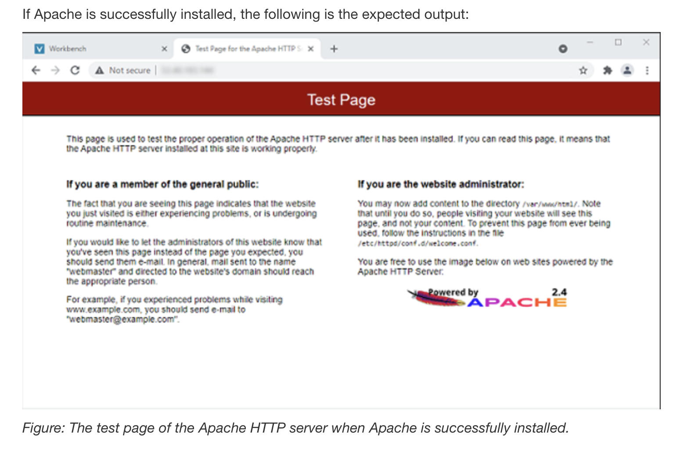

# Troubleshooting a Network Issue

**Objectives**

After completing this lab, the following skills were developed:

- Analyze a customer networking scenario  
- Troubleshoot AWS VPC connectivity issues  

---

## Scenario

I acted as a **Cloud Support Engineer at Amazon Web Services (AWS)**. A customer reported a networking issue within their AWS infrastructure.

### Customer Email

> Hello, Cloud Support!  
>
> When I created an Apache server through the command line, I could not ping it. I also received an error when entering the IP address in the browser. Could you please help figure out what is blocking my connection?  
>
> Thanks!  
>
> Ana  
> Contractor


The customer’s environment included a **Virtual Private Cloud (VPC)** with:
- An Internet Gateway  
- A public subnet  
- An Amazon EC2 instance running an Apache web server  

---

## Accessing the AWS Management Console

- The lab was started using **Start Lab**  
- The system displayed **Lab status: ready** before proceeding  
- The AWS Console was opened via the **AWS link** provided  
- The session automatically logged in
- 
---

## Task 1: Use SSH to Connect to an Amazon Linux EC2 Instance

An SSH connection was established to an **Amazon Linux EC2 instance**. The steps varied depending on the operating system used (Windows or macOS/Linux).

### Windows Users (PuTTY)

- The **Details** panel was opened and credentials were displayed  
- The **PPK file** (`labsuser.ppk`) was downloaded  
- The **Public IP address** was recorded  
- **PuTTY** was installed and opened  
- A secure SSH session was configured using the provided guide  

### macOS/Linux Users

- The **PEM key** (`labsuser.pem`) was downloaded  
- The **Public IP address** was recorded  
- A terminal window was opened and the following steps were completed:

- The directory was changed to where the key file was downloaded:
  ```bash
  cd ~/Downloads

- Permissions for the key file were changed to be read-only:
  ```
  chmod 400 labsuser.pem

- The EC2 instance was accessed using SSH (replacing <public-ip> with the actual IP address):
  ```
  ssh -i labsuser.pem ec2-user@<public-ip>
  
- When prompted, yes was entered to confirm the connection. No password was required because authentication was performed using the key pair.

---

## Task 2: Install and Start HTTPD

1. The Apache HTTP server was verified and started using the following commands:
   ```
   </> Bash
   sudo systemctl status httpd.service
   sudo systemctl start httpd.service
   sudo systemctl status httpd.service
   ```
   **The service was confirmed as active (running).**

2. Tried to access the Test page using the **Public IP address** that was recorded in Task 1:
   ```
   http://<PUBLIC-IP-OF-INSTANCE>
   ```
   **The page did not load at this stage, indicating a potential networking issue.**

 ---
 
 ## Task 3: Investigate the customer's VPC configuration

Ana, the customer requesting assistance, cannot reach her Apache server even though it is active.
I checked each service within the VPC to confirm if each resource was configured correctly.

1. Subnets - Are the route tables associated to the correct subnets?
2. Route Tables - Do the route tables have the correct routes?
3. Internet Gateway - Is there an Internet Gateway and is it attached?
4. Security Groups and network ACLs - Are the correct rules configured?
  
I pinged websites such as www.amazon.com using the ping command:
```bash
[ec2-user@ip-10-0-10-234 ~]$ ping -c 4 www.amazon.com
PING cf.47cf2c8c9-frontier.amazon.com (3.163.26.68) 56(84) bytes of data.
64 bytes from server-3-163-26-68.hio52.r.cloudfront.net (3.163.26.68): icmp_seq=1 ttl=249 time=5.33 ms
64 bytes from server-3-163-26-68.hio52.r.cloudfront.net (3.163.26.68): icmp_seq=2 ttl=249 time=5.36 ms
64 bytes from server-3-163-26-68.hio52.r.cloudfront.net (3.163.26.68): icmp_seq=3 ttl=249 time=5.31 ms
64 bytes from server-3-163-26-68.hio52.r.cloudfront.net (3.163.26.68): icmp_seq=4 ttl=249 time=5.32 ms

--- cf.47cf2c8c9-frontier.amazon.com ping statistics ---
4 packets transmitted, 4 received, 0% packet loss, time 3004ms
rtt min/avg/max/mdev = 5.314/5.334/5.362/0.075 ms
```
This confirmed that the internet could be reached, therefore the internet gateway and the route table were working.

**Instead, the security group lacked an inbound rule allowing HTTP traffic (port 80) from the internet (0.0.0.0/0). I added this rule to 
the Linux instance SG security group and retested the Apache server using its public URL.**
   



## Conclusion
In this lab, I troubleshot the customer's networking issue and found that the customer had an issue with their security ports in the security group. After fixing the issue, I was able to successfully load the Apache server.


## Additional resources
- [What is Amazon VPC?](https://docs.aws.amazon.com/vpc/latest/userguide/what-is-amazon-vpc.html)


