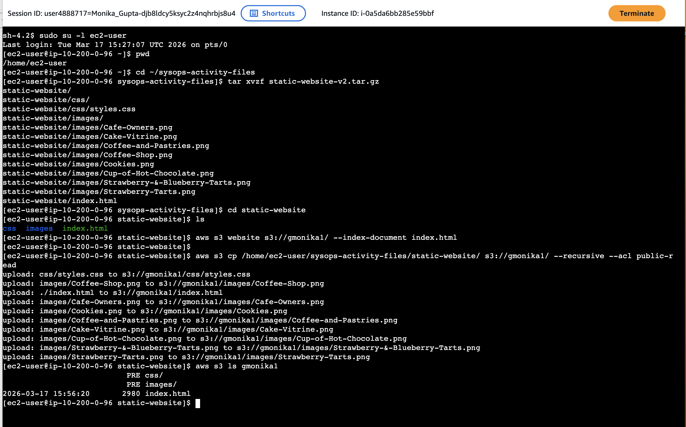
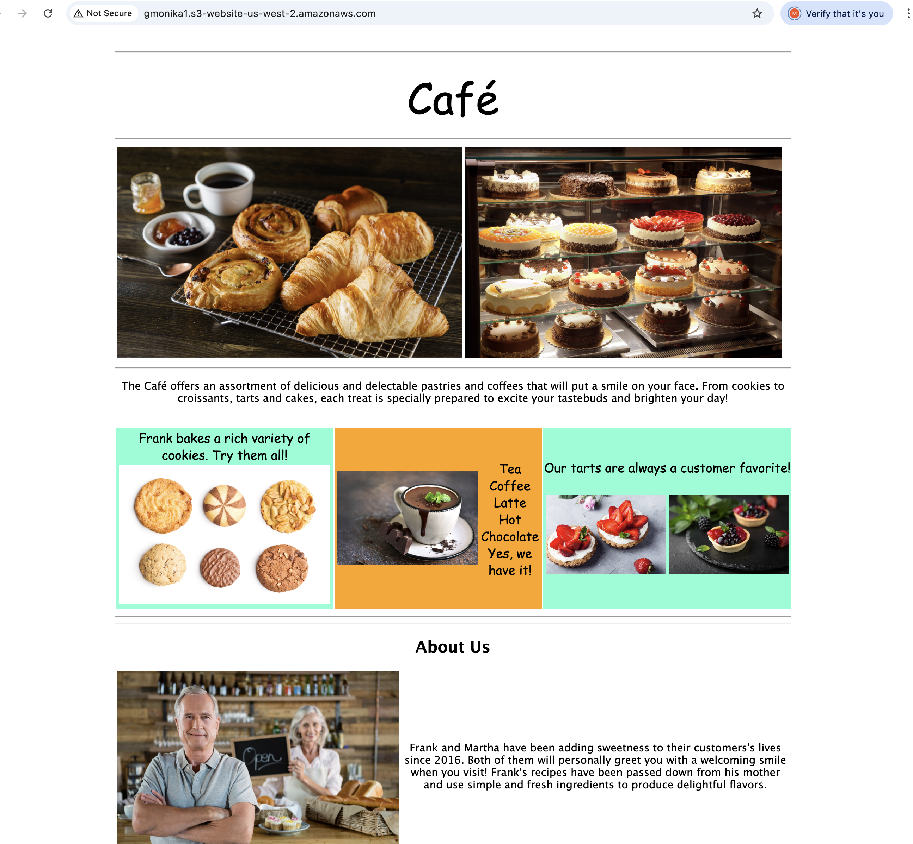

# Creating a Website on S3

## Lab Overview
In this lab, AWS Command Line Interface (AWS CLI) commands were used from an Amazon Elastic Compute Cloud (Amazon EC2) instance to:

- Create an Amazon Simple Storage Service (Amazon S3) bucket  
- Create a new AWS Identity and Access Management (IAM) user with full access to Amazon S3  
- Upload files to Amazon S3 to host a simple website for the Café & Bakery  
- Create a batch file to update the static website when local files were modified  

The following image shows the architecture diagram:


**Objectives**

After completing this lab, the following objectives were achieved:

- AWS CLI commands using IAM and Amazon S3 services were executed  
- A static website was deployed to an S3 bucket  
- A script was created to copy local files to Amazon S3  

---

### Accessing the AWS Management Console
The lab environment was launched, and access to the AWS Management Console was established. The console was opened in a new browser tab, and the session was automatically authenticated.

---

### Task 1: Connect to an Amazon Linux EC2 Instance Using SSM
A connection to the EC2 instance was established using AWS Systems Manager Session Manager.  

- Accessed the `Details` button at the top, then chose `Show`. Copied the values of `AWS Access Key ID`, `AWS Secret Access Key`for later reference.
- The **InstanceSessionUrl** was accessed in a browser  
- A terminal session was opened using `ssm-user`  
- The user context was switched to `ec2-user`  

```bash
sudo su -l ec2-user
pwd
```

>  This was the SSH terminal where commands were executed as instructed throughout the lab.

---

### Task 2: Configure the AWS CLI
The AWS CLI, which was pre-installed on the instance, was configured using provided credentials.

```
  aws configure
```

The following values were entered:

- **AWS Access Key ID**: (Enter value from Task 1)

- **AWS Secret Access Key**: (Enter value from Task 1)

- **Default region name**: `us-west-2`

- **Default output format**: `json`

---

### Task 3: Create an S3 Bucket Using the AWS CLI

The `s3api` command was used to create a new S3 bucket with the AWS credentials provided in the lab. By default, S3 buckets are created in the `us-east-1` Region.

> In this lab, both `s3api` and `s3` commands were used. The `s3` commands were built on top of the operations provided by `s3api`.

When creating a new S3 bucket, a globally unique name is required. A naming convention such as a combination of initials, last name, and random numbers was used (for example: `twhitlock256`).

To create the S3 bucket in the `us-west-2` Region, the following command was executed:

```bash
aws s3api create-bucket \
  --bucket <bucket-name> \
  --region us-west-2 \
  --create-bucket-configuration LocationConstraint=us-west-2
```

The command included:

- The --region us-west-2 parameter
- The --create-bucket-configuration LocationConstraint=us-west-2 parameter

Upon successful execution, a JSON-formatted response was returned containing a Location value that reflected the bucket name, for example:

```
</> JSON
{
  "Location": "http://twhitlock256.s3.amazonaws.com/"
}
```
---

### Task 4: Create a New IAM User with Full Access to Amazon S3

The AWS CLI command `aws iam create-user` was used to create a new IAM user for the AWS account. The `--user-name` option specified a unique username within the account.

A new IAM user named `awsS3user` was created using the following command:

```bash
 aws iam create-user --user-name awsS3user
```
A login profile for the new user was then created using the command:

```
 aws iam create-login-profile --user-name awsS3user --password Training123!
```
The AWS account ID was retrieved from the AWS Management Console and noted. The current session was signed out, and the console was accessed again using the newly created IAM user credentials:

- IAM user name: awsS3user
- Password: Training123!
- Account ID: (12-digit account number)

After logging in, the Amazon S3 console was opened. The previously created bucket was not immediately accessible because the new IAM user did not yet have the required permissions.

To identify the appropriate AWS managed policy that grants full access to Amazon S3, the following command was executed in the terminal:

```
  aws iam list-policies --query "Policies[?contains(PolicyName,'S3')]"
```

From the results, the policy providing full S3 access was located. This policy was then attached to the `awsS3user`:

```
  aws iam attach-user-policy \
    --policy-arn arn:aws:iam::aws:policy/<policy-name> \
    --user-name awsS3user
```

After attaching the policy, the AWS Management Console was refreshed, and the IAM user was granted full access to Amazon S3 resources.

---

### Task 5: Adjust S3 Bucket Permissions

In the AWS Management Console, the S3 bucket permissions were modified to allow public access:

- The bucket was selected in the Amazon S3 console  
- Under the **Permissions** tab, **Block public access (bucket settings)**, chose **Edit**
- **Block all public access** was deselected  
- Changes were saved and confirmed  

Next, Object Ownership settings were updated:

- Under **Object Ownership**, **Edit** was selected  
- **ACLs enabled** was chosen  
- The acknowledgment for restoring ACLs was confirmed  
- Changes were saved  

---

### Task 6: Extract the Files for the Lab

The archive containing the static website files was extracted in the SSH terminal.

The following commands were executed:

```bash
cd ~/sysops-activity-files
tar xvzf static-website-v2.tar.gz
cd static-website
```
To verify that the extraction was successful, the directory contents were listed:

```
  ls
```

The output confirmed the presence of:

- index.html
- css/ directory
- images/ directory

---

### Task 7: Upload Files to Amazon S3 Using the AWS CLI

After the website files were extracted, their contents were uploaded to the S3 bucket.

To configure the bucket for static website hosting, the following command was executed (with the bucket name substituted accordingly):

```bash
   aws s3 website s3://<bucket-name>/ --index-document index.html
```

`Thie above step ensured that index.html was set as the default index document`

The website files were then uploaded to the bucket using:
```
   aws s3 cp /home/ec2-user/sysops-activity-files/static-website/ \
   s3://<bucket-name>/ --recursive --acl public-read
```

   - --recursive flag ensured that all files and directories were uploaded
   - --acl public-read parameter granted public read access to the uploaded files

To verify that the files were successfully uploaded, the following command was run:

```
   aws s3 ls <bucket-name>
```

The following screenshot shows the commands run in Task 7 and the output:


<br>
In the **AWS Management Console**:

- The S3 bucket was opened
- The **Properties** tab was selected
- It was confirmed that **Static website hosting** was **enabled**

Finally, the **Bucket website endpoint** URL was opened in a browser, confirming that the static website was successfully deployed and publicly accessible as shown in the following screenshot:



---

### Task 8: Create a Batch File to Make Website Updates Repeatable

To enable repeatable deployments, a batch script was created using the VI editor.

The command history was first reviewed to locate the previously used `aws s3 cp` command:

```bash
   history
```

A new script file was then created in the home directory:

```
   cd ~
   touch update-website.sh
```

The file was opened in the VI editor:

```
   vi update-website.sh
```


Edit mode was entered, and the script was defined by adding the standard bash header along with the S3 copy command:

```
   #!/bin/bash
   aws s3 cp /home/ec2-user/sysops-activity-files/static-website/ \
   s3://<bucket-name>/ --recursive --acl public-read
```

The file was saved and closed, and execution permissions were applied:

```
   chmod +x update-website.sh
```

Modified Website Content:

- The `index.html` file was opened for editing:

  ```
     vi sysops-activity-files/static-website/index.html
  ```
  
- The following changes were made:

   bgcolor="aquamarine" was changed to bgcolor="gainsboro"
  
   bgcolor="orange" was changed to bgcolor="cornsilk"
  
   The second occurrence of bgcolor="aquamarine" was also changed to bgcolor="gainsboro"

After saving the changes, the script was executed to update the website:

```
  ./update-website.sh
```

`The command output confirmed that the updated files were copied to Amazon S3`

The website was refreshed in the browser, and the changes were successfully reflected.

A reusable deployment script was now available to efficiently push future updates from local files to the S3-hosted website.

---

## Conclusion

In this lab, a static website was successfully created and deployed using Amazon S3 and the AWS CLI. An S3 bucket was created and configured for static website hosting, and an IAM user with appropriate permissions was set up to manage access.
Website files were extracted and uploaded to the S3 bucket, making the site publicly accessible. Bucket permissions and settings were adjusted to enable public access and ensure proper functionality.
Additionally, a reusable batch script was created to automate future updates to the website. This improved efficiency by allowing quick synchronization of local changes with the S3-hosted site.

Overall, the lab demonstrated how to use AWS CLI tools to manage S3 resources, configure access control, and deploy and maintain a static website.

---

