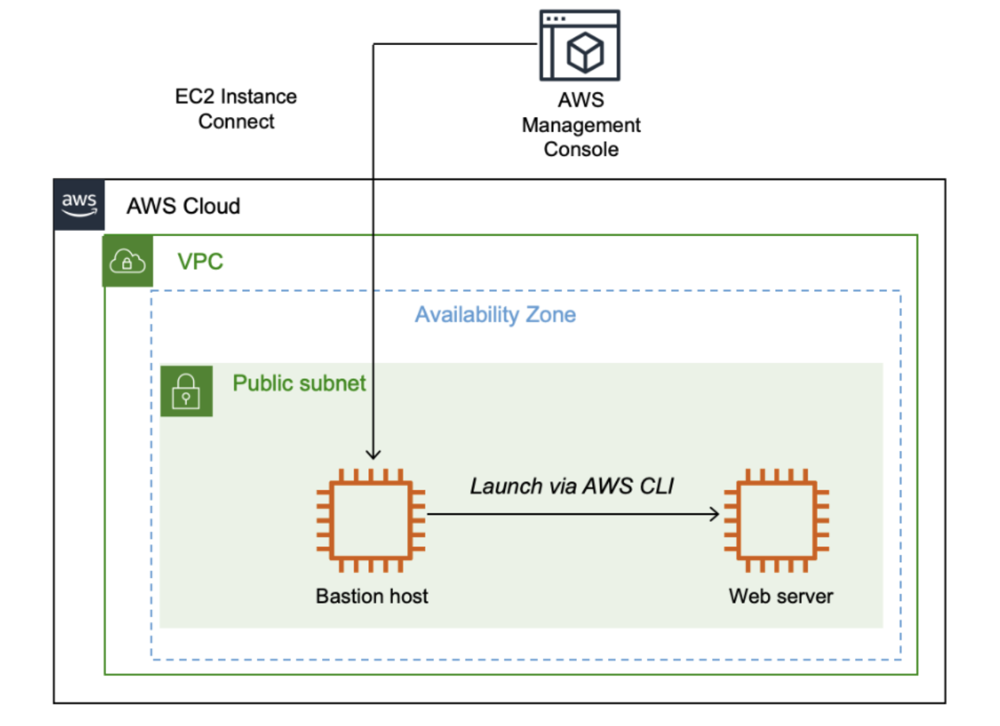

After completing this lab, you should be able to do the following:

--Launch an EC2 instance by using the AWS Management Console.

--Connect to the EC2 instance by using EC2 Instance Connect.

--Launch an EC2 instance by using the AWS CLI.

Task 1: Launching an EC2 Instance by using the AWS Management Console

    Step 1: Choose name and tags
    
    Step 2: Choose an AMI

    Step 3: Choose an instance type

    Step 4: Configure a key pair

    Step 5: Configure the network settings

    Step 6: Add storage

    Step 7: Configure advanced details

    Step 8: Launch an EC2 instance

Task 2: Logging in to the bastion host

Task 3: Launching an EC2 instance using the AWS CLI
 
     Step 1: Retrieve the AMI to use
     
     Step 2: Retrieve the subnet to use
     
     Step 3: Retrieve the security group to use
     
     Step 4: Download a user data script
     
    Step 5: Launch the instance
    
     Step 6: Wait for the instance to be ready
     
     Step 7: Test the web server

