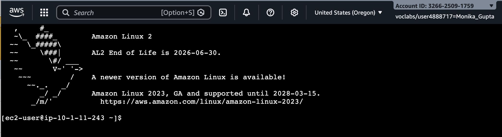

# Working with Amazon EBS (Elastic Block Store)

**Amazon EBS (Elastic Block Store)** is a cloud-based block storage service provided by Amazon Web Services for use with its virtual servers (Amazon EC2 instances). It is like a virtual hard drive in the cloud. It lets you store data that needs to persist even when an EC2 instance is stopped or restarted.

### Amazon EBS Key Benefits

- **Scalability:** Quickly scale storage performance and capacity to support enterprise-grade applications without disrupting operations.

- **High performance:** Provides high availability and durability, including replication within Availability Zones and up to 99.999% durability with io2 Block Express volumes.

- **Optimize storage and cost:** Choose different volume types to balance cost and performance, from low-cost general-purpose storage to high-IOPS, high-throughput options.

- **Security:** Encrypts data at rest and in transit while allowing you to control access and avoid managing your own encryption key infrastructure.

- **Simple data protection:** EBS Snapshots provide point-in-time backups that support disaster recovery, data migration, and compliance requirements.


### Amazon EBS Use Cases

- **Databases**: Supports low-latency storage for SQL and NoSQL databases.  
- **Boot volumes**: Provides persistent root storage for EC2 instances.  
- **Enterprise applications**: Runs critical systems like ERP and CRM.  
- **Big data workloads**: Stores large datasets for analytics and processing.  
- **Development and testing**: Quickly creates and deletes test environments.  
- **Backups and recovery**: Uses snapshots for disaster recovery via Amazon S3.


## Lab overview

In this lab, I learnt how to create an EBS volume and perform operations on it, such as attaching it to an instance, creating a file system, and taking a snapshot backup.

**Objectives:**

- Create an EBS volume.
- Attach and mount an EBS volume to an EC2 instance.
- Create a snapshot of an EBS volume.
- Create an EBS volume from a snapshot.

---

### Task 1: Creating a new EBS volume

In this task, I created and attached an EBS volume to a new EC2 instance.

- On the AWS Management Console, searched for and chose **EC2** to open the EC2 Management Console.  
- In the left navigation pane, chose **Instances**.  
- An EC2 instance named **Lab** had already been launched for the lab.  
- Noted the **Availability Zone** of the Lab instance (e.g., `us-west-2a`).  
- In the left navigation pane, under **Elastic Block Store**, chose **Volumes**.  
- An existing 8 GiB volume is already attached to the instance.  
- Chose **Create volume** and configured:  
  - Volume type: **General Purpose SSD (gp2)**  
  - Size (GiB): **1**  
  - Availability Zone: same as Lab instance (e.g., `us-west-2a`)  
- In **Tags (optional)**, added:  
  - Key: `Name`  
  - Value: `My Volume`  
- Chose **Create volume**.  
- Waited until the volume state changes from **Creating** to **Available**.

The following screenshot shows the successfully newly created volume: 


<br>

---

### Task 2: Attaching the volume to an EC2 instance

- Selected **My Volume**.  
- From the **Actions** menu, chose **Attach volume**.  
- Selected the **Lab** instance from the Instance dropdown.  
- Set Device name to `/dev/sdb`.  
- Chose **Attach volume**.  
- The volume state will change to **In-use**.

The following screenshot shows that the volume was attached to the EC2 Instance successfully:


---

### Task 3: Connecting to the Lab EC2 instance

- Searched for and chose **EC2** in the AWS Management Console.  
- In the navigation pane, chose **Instances**.  
- Selected the **Lab** instance from the list.  
- Chose **Connect**.  
- Opened the **EC2 Instance Connect** tab and clicked **Connect**.  
- A new browser tab opened with a terminal session similar to the following screenshot:

  
  
- Used this terminal for all lab tasks; reconnected if it became unresponsive.

---

### Task 4: Creating and configuring the file system

In this task, I configured the new EBS volume as an ext3 file system and mounted it on a Linux instance.

- In the EC2 Instance Connect terminal, checked available storage:  

   ```bash
  df -h
   ```
- The output was :

  ```
  devtmpfs        464M     0  464M   0% /dev
  tmpfs           473M     0  473M   0% /dev/shm
  tmpfs           473M  464K  472M   1% /run
  tmpfs           473M     0  473M   0% /sys/fs/cgroup
  /dev/nvme0n1p1  8.0G  1.7G  6.4G  21% /
  tmpfs            95M     0   95M   0% /run/user/0
  tmpfs            95M     0   95M   0% /run/user/1000
  ```
 
`This output showed the original 8 GB root volume.
 The new EBS volume was not yet visible because it was not formatted or mounted yet. `

- Created an ext3 file system on the new volume, executed the following command:

  ```sudo mkfs -t ext3 /dev/sdb
  ```

- Created a directory to mount the new storage volume, executed the following command:

  ```sudo mkdir /mnt/data-store
  ```

- Used the following command to mount the new volume:

  ```
  sudo mount /dev/sdb /mnt/data-store
  echo "/dev/sdb   /mnt/data-store ext3 defaults,noatime 1 2" | sudo tee -a /etc/fstab
  ```

  `The last line in this command ensured that the volume was mounted even after the instance was restarted.`

- To view the configuration file to see the setting on the last line, executed the following command:

  ```cat /etc/fstab
  ```
  
- To view the available storage again, executed the following command:

  ```df -h
  ```
  
  `The output now contains an additional line similar to the following: /dev/nvme1n1`

```
  Filesystem      Size  Used Avail Use% Mounted on
  devtmpfs        464M     0  464M   0% /dev
  tmpfs           473M     0  473M   0% /dev/shm
  tmpfs           473M  464K  472M   1% /run
  tmpfs           473M     0  473M   0% /sys/fs/cgroup
  /dev/nvme0n1p1  8.0G  1.7G  6.4G  21% /
  tmpfs            95M     0   95M   0% /run/user/0
  tmpfs            95M     0   95M   0% /run/user/1000
  /dev/nvme1n1    975M   60K  924M   1% /mnt/data-store
```

- To create a file and add some text on the mounted volume, executed the following command:

```
  sudo sh -c "echo some text has been written > /mnt/data-store/file.txt"
```

- To verify that the text has been written to my volume, executed the following command:

```
 cat /mnt/data-store/file.txt
```

   The output displays the text that this command copies to the file. 

---

### Task 5: Creating an Amazon EBS snapshot

In this task, I created a snapshot of my EBS volume.

`Amazon EBS snapshots are stored in Amazon Simple Storage Service (Amazon S3) for durability. New EBS volumes can be created out of snapshots for cloning or restoring backups. Amazon EBS snapshots can also be shared among Amazon Web Services (AWS) accounts or copied over AWS Regions.`

- On the EC2 Management Console, chose **Volumes**, and selected **My Volume**.

- From the Actions menu, chose **Create snapshot**.

- In the Tags section, chose **Add tag**, and then configured the following options:

    Key:`Name`.

    Value:`My Snapshot`.

- Chose **Create snapshot**.

- In the left navigation pane, chose **Snapshots**.

The Snapshot status of your snapshot was `Pending`. After completion, the status changed to `Completed`. Only used storage blocks are copied to snapshots, so empty blocks do not use any snapshot storage space.

- In the EC2 Instance Connect terminal window, to delete the file that I created on my volume, executed the following command:

```
  sudo rm /mnt/data-store/file.txt
```

- To verify that the file was deleted, used the following command:

```
   ls /mnt/data-store/file.txt
```

The following message displays: `ls: cannot access /mnt/data-store/file.txt: No such file or directory`

The file was deleted.

---

### Task 6: Restoring the Amazon EBS snapshot

#### Task 6.1: Created a volume by using the snapshot

- On the EC2 Management Console, selected **My Snapshot**.

- From the Actions menu, chose **Create volume from snapshot**.

- For Availability Zone, chose the same Availability Zone that was used earlier in Task 1.

- In the Tags - optional section, chose **Add tag**, and then configure the following options:

     Key: `Name`

     Value: `Restored Volume`

- Chose **Create volume**

- To see the new volume, in the left navigation, chose **Volumes**.

   The Volume status of the new volume is `Available`.

   When restoring a snapshot to a new volume, the configuration can also be modified, such as changing the volume type, size, or       Availability Zone.

#### Task 6.2: Attached the restored volume to the EC2 instance

- Selected **Restored Volume**.

- From the Actions menu, chose **Attach volume**.

- From the Instance dropdown list, chose the Lab instance.

- For the Device name field, chose `/dev/sdc`. I used this device identifier in a later task.

- Chose **Attach volume**.

  The Volume status of your volume is now `In-use`.

#### Task 6.3: Mounting the restored volume

- To create a directory for mounting the new storage volume, in the EC2 Instance Connect terminal, used the following command:

```
  sudo mkdir /mnt/data-store2
```

- To mount the new volume, executed the following command:

```
 sudo mount /dev/sdc /mnt/data-store2
```

- To verify that the volume that has been mounted has the file that I created earlier, executed the following command:

```
 ls /mnt/data-store2/file.txt
```

I noticed the file.txt file.

---

# Conclusion

In this lab, I successfully created, attached, and configured an Amazon EBS volume for an EC2 instance. I learnt how to provision storage, connect it to a virtual machine, and prepare it for use by creating and mounting a file system. This demonstrates how EBS provides flexible, persistent, and scalable storage for cloud-based applications.

---


