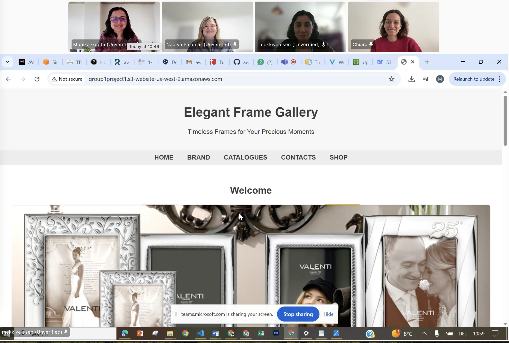
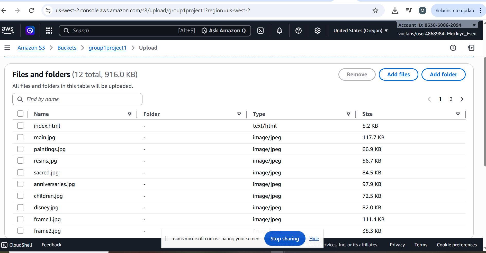
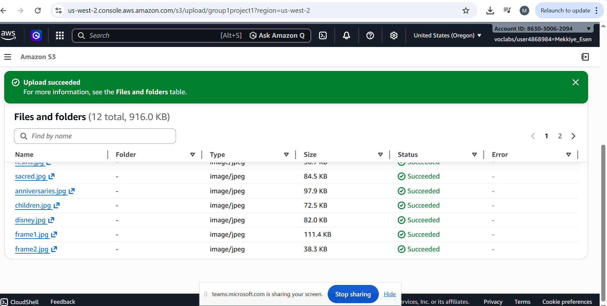

<!-- ================= Project Documentation ================= -->
<h1 align="center">📘 Project Documentation</h1>

<h2>📑 Outline</h2>
<ul>
  <li>Company Overview</li>
  <li>Current Challenges</li>
  <li>Why Use AWS</li>
  <li>Our Solution: Static Website</li>
  <li>Website Enhancement Ideas</li>
  <li>Conclusion</li>
</ul>

<!-- ================= Company Overview ================= -->
<h2>🏢 Company Overview</h2>

  <b>Elegant Frame Gallery</b> is a Swiss-based company specializing in high-quality photo frames 
  for retail and commercial customers. The company offers a wide range of stylish and durable 
  frames designed for homes, offices, galleries, and commercial spaces.

  Elegant Frame is dedicated to serving individual customers who value design, quality, and craftsmanship, 
  providing products that enhance and preserve their most meaningful moments.

  The main office is located in <b>St Gallen, Switzerland</b>, with branches across the country. 
  The company currently supports around <b>1000 concurrent users</b>, and the business is growing rapidly.

<!-- ================= Current Challenges ================= -->
<h2>⚠️ Current Challenges</h2>

<h3>☁️ Migration to the Cloud</h3>

  The company has not migrated to the cloud and relies on manual or on-premises systems 
  to manage bookings and orders.

<h3>📈 Scalability</h3>

  As the number of products and customers grows, the company needs a system that can handle 
  increased traffic and data.

<h3>⚡ Website Performance</h3>

  Slow loading times, especially for images, negatively affect customer experience and sales. 
  This impacts user experience and conversion rates.

<h3>📝 Content Management</h3>

  Updating product information and images manually is time-consuming.

<h3>🌐 Availability</h3>

  The website must be accessible at all times for clients.

<h3>🔒 Security</h3>

  Keep customer data and website safe.

<!-- ================= Why Use AWS ================= -->
<h2>☁️ Why Use AWS</h2>

  Using <b>Amazon Web Services (AWS)</b> can help Elegant Frame solve these challenges:

<ul>
  <li><b>Reliable storage with Amazon S3:</b> Store all product images securely and access them quickly from anywhere.</li>
  <li><b>High performance and speed:</b> Fast delivery of images and website content improves user experience.</li>
  <li><b>Scalability:</b> Easily handle growth in products, users, and traffic without changing infrastructure.</li>
  <li><b>Cost efficiency (Pay-as-you-go):</b> Pay only for what is used, ideal for a growing business.</li>
  <li><b>Static website hosting:</b> Simple and reliable hosting for a company website or product catalog.</li>
</ul>

<!-- ================= Solution Project ================= -->
<h2>💡 Solution Project</h2>

<h3>Elegant Frames Gallery Website (AWS Project)</h3>

  

  <b>Project Goal:</b> To build a simple static website for Elegant Frames Gallery using the AWS sandbox lab environment.

  This project demonstrates how to build and deploy a static website using AWS. 
  The website includes features such as <b>Home, Brand, Catalogues, Contacts, and Shop</b>.

  <b>Technologies used:</b> HTML and CSS for front-end design, hosted on Amazon S3 with static website hosting enabled. 
  Website files are stored in an S3 bucket with a bucket policy allowing public access. 
  The site is accessed via the S3 endpoint URL in the AWS sandbox environment.

  

<h3>📌 Steps Followed</h3>
<ol>
  <li><b>Create the Website Files:</b>
    <ul>
      <li>Create the main page using HTML and store it as <code>index.html</code>.</li>
      <li>Store image files for the website.</li>
    </ul>
  </li>
  <li><b>Log in to AWS Sandbox Environment:</b>
    <ul>
      <li>Open AWS Management Console</li>
      <li>Navigate to Amazon S3</li>
    </ul>
  </li>
  <li><b>Create an S3 Bucket:</b>
    <ul>
      <li>Create a unique bucket name</li>
      <li>Select the region</li>
      <li>Disable Block Public Access</li>
    </ul>
  </li>
  <li><b>Enable Static Website Hosting</b></li>
  <li><b>Upload Website Files:</b> Upload <code>index.html</code> and image assets.</li>

   
  

  

   
  

  

 
  <li><b>Add Bucket Policy:</b> Make your bucket content publicly available.</li>
  <li><b>Test the Website Endpoint:</b>
    <ul>
      <li>Under Buckets, choose your bucket name</li>
      <li>Go to Properties → Static website hosting → Bucket website endpoint</li>
      <li>The <code>index.html</code> page opens in a new browser window.</li>
    </ul>
  </li>
  <li><b>Verify:</b> Ensure the website loads correctly and the link works.</li>
</ol>

<!-- ================= Website Enhancement Ideas ================= -->
<h2>🚀 Website Enhancement Ideas</h2>
<ul>
  <li>Add a sign-in page or booking system using AWS Cognito for user authentication, allowing customers to log in and manage bookings and orders.</li>
  <li>Connect booking forms using Amazon Lambda for backend logic.</li>
  <li>Implement a backend database (Amazon RDS or DynamoDB) to store customer data, bookings, and other details.</li>
  <li>Use CloudFront to serve B2B customer branches with global content delivery, high reliability, and low latency.</li>
</ul>

<!-- ================= Conclusion ================= -->
<h2>✅ Conclusion</h2>

  By using AWS, Elegant Frame can improve its online presence, provide a better customer experience, 
  and scale efficiently for wholesale and retail markets.
  Static hosting on Amazon S3 ensures fast loading times and handles traffic growth automatically. 
  The website is user-friendly, allowing users to update products and images without technical expertise. 
  It is also future-ready for user logins, databases, or B2B customer portals.

